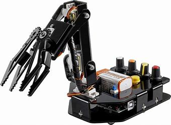
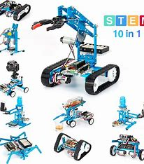
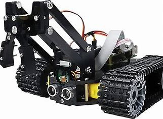
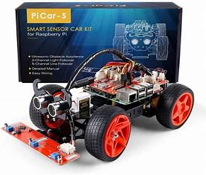

<!DOCTYPE html>
<html lang="en">
<head>
  <meta charset="UTF-8">
  <meta name="viewport" content="width=device-width, initial-scale=1.0">
  <title>Amazon Clone</title>
  <link rel="stylesheet" href="styles.css">
</head>
<body>
  <!-- Header -->
  <header>
    

      
    

    

      <input type="text" placeholder="Search for products...">
      <button>Search</button>
    

    

      <a href="#">Account</a>
      <a href="#">Cart</a>
    

  </header>

  <!-- Hero Section -->
  <section class="hero">
    
  </section>

  <!-- Product Grid -->
  <section class="product-grid">
    

      
      <h3>Product 1</h3>
      
$19.99

      <button>Add to Cart</button>
    

    

      
      <h3>Product 2</h3>
      
$29.99

      <button>Add to Cart</button>
    

    

      
      <h3>Product 3</h3>
      
$39.99

      <button>Add to Cart</button>
    

    

      
      <h3>Product 4</h3>
      
$49.99

      <button>Add to Cart</button>
    

    

        
        <h3>Product 6</h3>
        
$49.99

        <button>Add to Cart</button>
      

  </section>

  <!-- Footer -->
  <footer>
    
&copy; 2023 Amazon Clone. All rights reserved.

  </footer>
</body>
</html>
